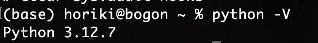
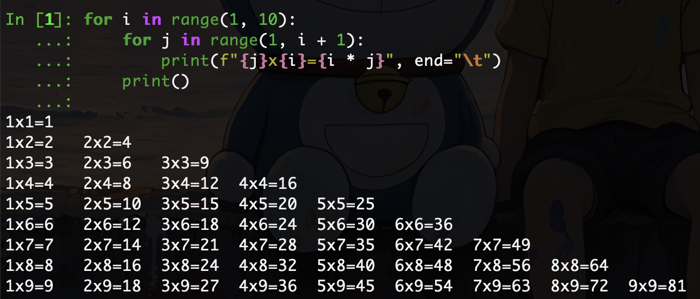
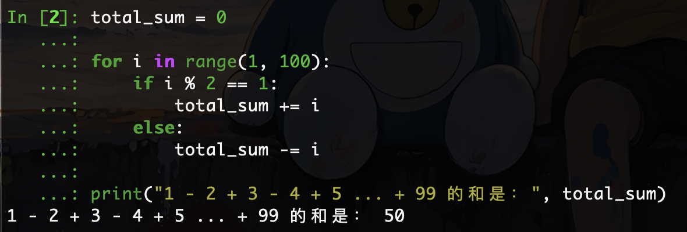
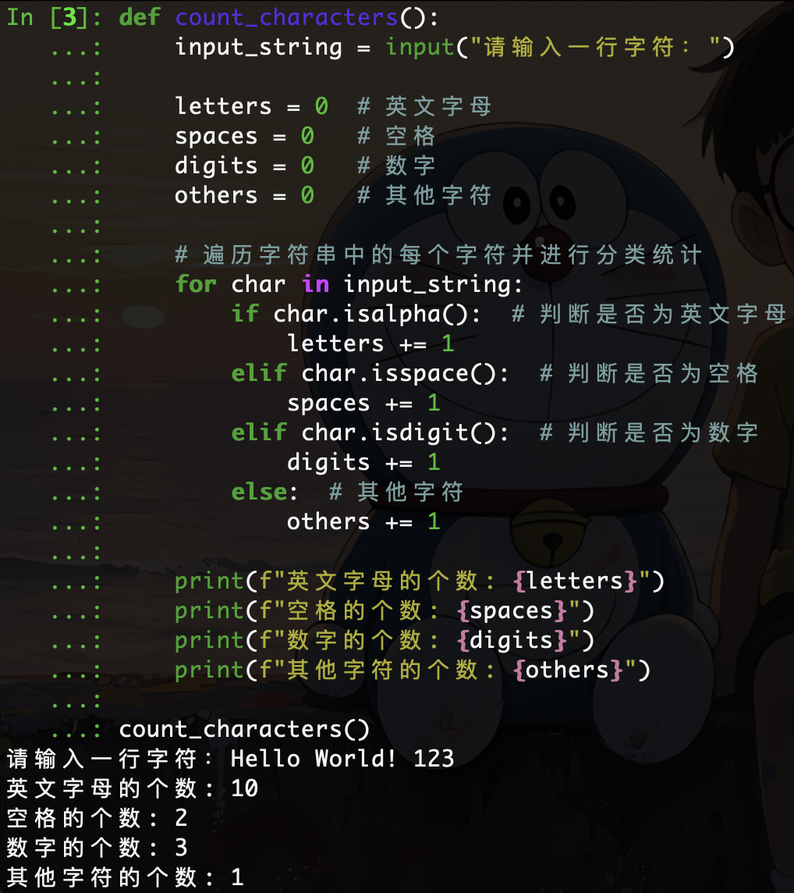

# Python 第1次作业

作业要求：安装python3环境，完成课件中的任意一道编程练习题，提交代码及运行结果。

# 安装Python3环境

使用python -V查看安装的python3环境：




# 编程练习题

## 第一题：打印九九乘法表

### Python代码

```python 
for i in range(1, 10):
    for j in range(1, i + 1):
        print(f"{j}x{i}={i * j}", end="\t")
    print()
```


### 运行结果

运行上述代码后，会生成如下格式的九九乘法表：




## 第二题：求1-2+3-4+5 ... 99的所有数的和

要计算 `1 - 2 + 3 - 4 + 5 ... + 99` 的所有数的和，可以通过循环遍历从 1 到 99 的所有整数，并根据其奇偶性来决定是加还是减。

### Python代码

```python 
total_sum = 0

for i in range(1, 100):
    if i % 2 == 1:
        total_sum += i
    else:
        total_sum -= i

print("1 - 2 + 3 - 4 + 5 ... + 99 的和是：", total_sum)
```


### 运行结果




## 第三题：输入一行字符， 分别统计出其中英文字母、空格、数字和其它字符的个数

### Python代码

```python 
def count_characters():
    input_string = input("请输入一行字符：")

    letters = 0  # 英文字母
    spaces = 0   # 空格
    digits = 0   # 数字
    others = 0   # 其他字符

    # 遍历字符串中的每个字符并进行分类统计
    for char in input_string:
        if char.isalpha():  # 判断是否为英文字母
            letters += 1
        elif char.isspace():  # 判断是否为空格
            spaces += 1
        elif char.isdigit():  # 判断是否为数字
            digits += 1
        else:  # 其他字符
            others += 1

    print(f"英文字母的个数: {letters}")
    print(f"空格的个数: {spaces}")
    print(f"数字的个数: {digits}")
    print(f"其他字符的个数: {others}")

count_characters()
```


### 运行结果


