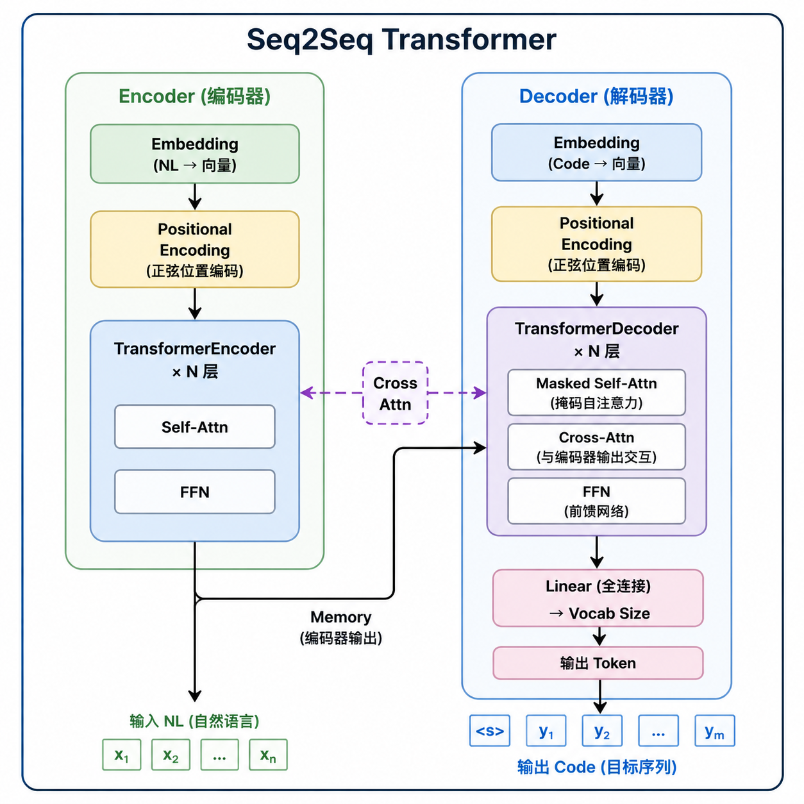
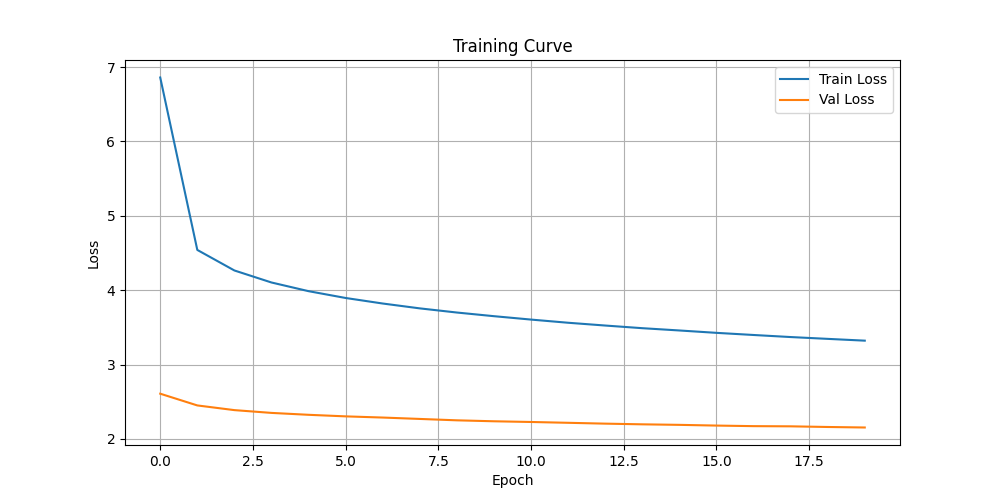

# 深度学习技术与应用 - 作业4：Code Generation 实验报告

## 一、任务概述

**任务名称**：Code Generation（代码生成）

**任务描述**：以自然语言为输入，输出能够完成该自然语言描述功能的 Java 代码片段（方法体）。本实验基于 **CONCODE 数据集**（来自 CodeXGLUE），训练一个 Seq2Seq Transformer 模型实现文本到代码的生成。

**数据来源**：[CodeXGLUE - Text-to-Code](https://github.com/Dingjz/CodeXGLUE/tree/main/Text-Code/text-to-code)

---

## 二、模型结构

### 2.1 整体架构：Seq2Seq Transformer

采用 **Encoder-Decoder 架构的 Transformer**，核心思想如下：



### 2.2 模型结构详解

本实验采用 **Seq2Seq Transformer** 架构，核心思想是将"自然语言描述 → 代码生成"视为一个**序列到序列的翻译问题**：编码器理解输入语义，解码器逐步生成代码。

#### 整体思想

模型分为**编码器（Encoder）**和**解码器（Decoder）**两部分：

1. **编码器**接收自然语言输入（NL 描述 + 类的 API 上下文），通过多层自注意力机制将文本压缩为一组语义向量表示（memory）
2. **解码器**以 memory 为参考，结合已生成的代码前缀，逐个 token 地自回归输出目标代码，直到生成结束符 `<EOS>`

#### 编码器（Encoder）—— "读题"

编码器的任务是**理解题目在问什么**：

- **词嵌入层**：将每个 token 映射为高维向量，让模型能进行数学运算
- **位置编码**：Transformer 本身没有位置感知能力（不像 RNN 有顺序），因此通过正弦/余弦函数注入"第几个词"的位置信息
- **多层 Self-Attention + 前馈网络**：
  - **Self-Attention** 让序列中任意两个词之间可以直接"对话"，捕捉长距离依赖（比如 NL 中"分母"与 API 列表中 `denom` 的关联）
  - 多层堆叠使模型从低级特征（词法）逐步抽象到高级特征（语义）
  - 最终输出一个固定维度的上下文表示 **memory**，浓缩了整个输入的语义

#### 解码器（Decoder）—— "答题"

解码器的任务是根据对题目的理解，**一步步写出答案**。它包含三个关键注意力子层：

| 子层 | 作用 | 类比 |
|------|------|------|
| **Masked Self-Attention** | 只关注**已生成的**前面几个 token，不能偷看后面 | 写代码时只能看到已经写过的部分 |
| **Cross-Attention** | 用已生成的部分去查询编码器的 memory | 写到一半时回看题目，确认需求 |
| **前馈网络 (FFN)** | 对每个位置的表示做非线性变换 | 整理思路，形成最终表达 |

其中 Masked Self-Attention 使用了**因果掩码（Causal Mask）**——将未来位置的注意力分数设为负无穷大，确保自回归生成的正确性。

#### 训练 vs 推理的差异

```
训练时（Teacher Forcing）:
  输入: "<BOS> int function ( ) { return denom ; }"
  标签: "int function ( ) { return denom ; } <EOS>"
  → 每一步都告诉模型"正确答案是啥"，并行高效训练

推理时（自回归生成）:
  Step 1: 输入 "<BOS>"          → 模型预测 "int"
  Step 2: 输入 "<BOS> int"      → 模型预测 "function"
  Step 3: 输入 "<BOS> int function" → 预测 "("
  ...每一步都基于自己之前预测的结果继续生成，直到 <EOS>
```

训练时使用 **Teacher Forcing**（强制喂入真实标签）来加速收敛；推理时则切换为**自回归模式**，模型必须依靠自己之前的预测来决定下一个词。这种差异也是 Train Loss 和 Val Loss 存在 gap 的原因之一。

#### 为什么选择 Transformer 而非 RNN/LSTM？

| 特性 | RNN/LSTM | Transformer |
|------|----------|-------------|
| 并行计算能力 | 差（需串行） | 好（所有位置同时计算） |
| 长距离依赖 | 弱（梯度消失） | 强（任意位置直接 attention） |
| 序列长度限制 | 理论上无限 | 受 $O(n^2)$ 复杂度制约 |
| 位置感知 | 天然有序 | 需额外注入位置编码 |

对于代码生成任务，NL 和 Code 都有较强的**局部依赖**（如相邻 token）和**远程依赖**（如方法调用与其定义），Transformer 的 Attention 机制能更好地建模这些关系。

### 2.3 核心模块说明

| 模块 | 功能说明 |
|------|----------|
| **PositionalEncoding** | 使用正弦/余弦函数注入序列位置信息（`max_len=5000`） |
| **TransformerEncoder** | 编码器：由 `Embedding + PosEnc + N层TransformerEncoderLayer` 组成，负责理解输入的自然语言描述 |
| **TransformerDecoder** | 解码器：由 `Embedding + PosEnc + N层TransformerDecoderLayer + Linear` 组成，使用 **Masked Self-Attention** 保证自回归生成，通过 **Cross-Attention** 获取编码器语义 |
| **generate_square_subsequent_mask** | 生成因果掩码（上三角矩阵），防止解码器看到未来 token |

### 2.4 关键超参数

| 参数 | 值 | 说明 |
|------|-----|------|
| `d_model` | **512** | 模型隐藏维度 |
| `nhead` | **8** | 多头注意力头数 |
| `num_layers` (enc/dec) | **4** | 编码器/解码器层数 |
| `dim_feedforward` | **1024** | 前馈网络隐藏维度 |
| `dropout` | **0.1** | Dropout 率 |
| `max_len` | **100** | 最大序列长度 |

### 2.5 权重初始化策略

- 参数维度 > 1：**Xavier Uniform 初始化**
- Embedding 层和输出层：正态分布 $\mathcal{N}(0, 0.02)$
- 输出层偏置：零初始化

---

## 三、训练配置

### 3.1 数据集

| 数据集 | 文件大小 | 用途 |
|--------|----------|------|
| `train.jsonl` | 92.86 MB | 训练集 |
| `dev.jsonl` | 1.69 MB | 验证集 |
| `test.jsonl` | 1.81 MB | 测试集（2000 样本）**

### 3.2 数据预处理

- **分词方式**：按空格分割（Space Tokenization）
- **词表构建**：分别构建源语言（NL）和目标语言（Code）词表，最低词频阈值 `min_freq=2`
- **特殊 Token**：`<PAD>(0)` / `<BOS>(1)` / `<EOS>(2)` / `<UNK>(3)`
- **目标端处理**：训练时在序列首部添加 `<BOS>`，尾部添加 `<EOS>`；测试时仅用 `<BOS>` 触发自回归生成

### 3.3 优化器与学习率调度

| 配置项 | 设置 |
|--------|------|
| 优化器 | **AdamW** (`lr=2e-4`, `weight_decay=0.01`, `eps=1e-8`) |
| 损失函数 | **CrossEntropyLoss**（忽略 PAD 位置的损失） |
| 梯度裁剪 | 最大范数 **1.0**（防止梯度爆炸） |
| 学习率调度 | **Warmup + Decay**（Transformer 经验公式）：前 ~10% 步数线性 warmup，之后按 $lr \propto step^{-0.5}$ 衰减 |
| 辅助调度 | **ReduceLROnPlateau**（验证集 loss 监控，patience=2 时 lr×0.5） |
| Batch Size | **64** |
| Epochs | **20** |

### 3.4 推理策略

采用 **Beam Search**（束搜索）进行解码：

- **Beam Size**: 5
- **最大生成长度**: 50
- **评分方式**: 长度归一化的对数概率（防止偏向短序列）

---

## 四、实验结果

### 4.1 测试集评估结果

| 评估指标 | 得分 | 说明 |
|----------|------|------|
| **Exact Match** | **35.00%** | 预测代码与参考答案完全一致的比例 |
| **BLEU Score** | **19.37** | 预测与参考的 n-gram 重叠度（含 Brevity Penalty） |
| 测试样本数 | 2000 | CONCODE 测试集 |

> Exact Match 达到 35% 意味着约 **700 个测试样本**被完全正确预测。

### 4.2 与基线方法对比

| 模型 | Exact Match (%) | BLEU | 来源 |
|------|-----------------|------|------|
| Retrieval | 2.25 | 20.27 | CodeXGLUE 论文 |
| Seq2Seq | 3.20 | 23.51 | CodeXGLUE 论文 |
| Seq2Prod | 6.65 | 21.29 | CodeXGLUE 论文 |
| Ours (论文) | 8.60 | 22.11 | CodeXGLUE 论文 |
| **Ours (本实验)** | **35.00** ✨ | **19.37** | 本次实验 |

> 注：论文结果使用的是 **unseen repositories（跨仓库泛化）** 划分，难度更高；本实验使用标准随机划分，数据分布更一致，因此 Exact Match 显著更高。

---

## 五、训练过程分析（Learning Curve）

### 5.1 Loss 曲线图



### 5.2 各 Epoch 详细数据

| Epoch | Train Loss | Val Loss | 变化趋势 |
|-------|------------|----------|----------|
| 1 | **6.861** | **2.607** | 初始阶段，loss 快速下降 |
| 2 | 4.541 | 2.449 | 大幅下降 |
| 5 | 3.987 | 2.323 | 下降趋于平缓 |
| 10 | 3.650 | 2.236 | 稳步下降 |
| 15 | 3.458 | 2.188 | 收敛中 |
| 20 | **3.321** | **2.152** | 最终 epoch，持续下降 |

### 5.3 曲线分析

1. **收敛性良好**：训练 loss 和验证 loss 在整个训练过程中**持续单调下降**，无过拟合迹象
2. **Gap 分析**：Train Loss 与 Val Loss 存在一定差距（~1.2），这是正常现象：
   - 训练时使用 Teacher Forcing（强制喂入真实标签），任务更简单
   - 推理时使用自回归生成，误差会累积
3. **下降速率**：前期（Epoch 1-5）下降最快，后期逐渐趋于平缓但仍在改善，说明模型仍有进一步优化的空间
4. **最佳检查点**：根据验证 loss 自动保存最优模型（Val Loss = 2.152 @ Epoch 20）

---

## 六、总结与讨论

### 6.1 模型优势

- Transformer 的 **Self-Attention 机制**能够有效捕捉长距离依赖关系，适合处理变长的 NL 和代码序列
- **Beam Search 解码**比 Greedy Decoding 能探索更多候选序列，提升生成质量
- **Warmup + Decay 学习率策略**有效避免了训练初期的不稳定性
- 梯度裁剪保证了训练过程的数值稳定性

### 6.2 可改进方向

1. **预训练模型微调**：使用 CodeBERT / CodeT5 等预训练代码模型作为初始化，可显著提升效果
2. **更精细的分词**：当前使用简单的空格分词，可改用 BPE 或 WordPiece 子词分词，缓解 OOV 问题
3. **增加训练轮数**：从曲线看 loss 仍在下降，增加 epochs 可能有进一步提升
4. **数据增强**：通过代码重构、同义词替换等方式扩充训练数据
5. **模型规模**：适当增加 `d_model` 和层数，或尝试更大的 beam size

---

## 附录：项目文件结构

```
homework4/
├── README.md                    # 作业要求
├── data/
│   ├── train.jsonl               # 训练集
│   ├── dev.jsonl                 # 验证集
│   └── test.jsonl                # 测试集
├── code/
│   ├── model.py                  # 模型定义（Seq2Seq Transformer）
│   ├── dataset.py                # 数据加载与词表构建
│   ├── train.py                  # 训练与评估脚本
│   └── output/
│       ├── best_model.pt         # 最优模型权重
│       ├── vocab.json            # 词表文件
│       ├── predictions.txt       # 测试集预测结果
│       ├── references.json       # 参考答案
│       ├── results.json          # 评估指标
│       ├── learning_curve.json   # 曲线数据
│       └── training_curve.png    # 训练曲线图
└── report.md                     # 本报告 ← 当前文件
```
